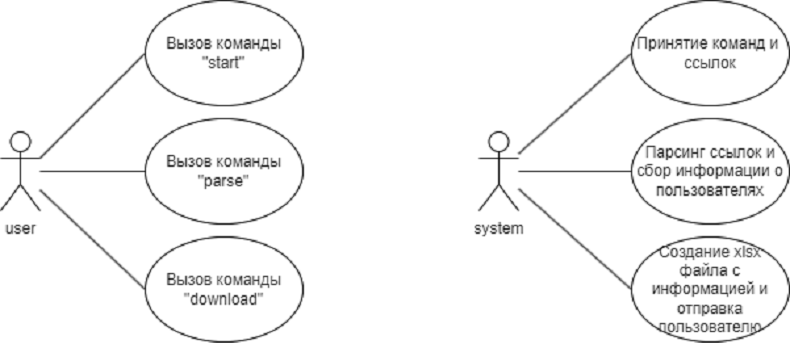

# Курсовой проект: Бот для анализа пользователей в чатах

## Команда проекта

**Группа:** 5130202/20202

- **Копышко Иван Васильевич**  
- **Задворная Александра Александровна**  
- **Скрипкарь Антон Федорович**  
- **Райкевич Иван Федорович**  
- **Старцева Татьяна Дмитриевна**

---

## 1. Определение проблемы

Большинство чатов не предоставляет удобных инструментов для сбора и анализа данных о пользователях. Это усложняет задачу маркетологам и администраторам, которым нужно идентифицировать заинтересованных пользователей. Вручной сбор данных занимает много времени и подвержен ошибкам, особенно при больших объемах.

---

## 2. Цели и задачи проекта

**Цель:**  
Создание эффективного инструмента для сбора и анализа пользовательских данных из чатов.

**Задачи:**

- Разработка алгоритма парсинга информации о пользователях.
- Реализация системы хранения данных с функцией предотвращения дублирования.
- Создание интерфейса для выборки пользователей по заданным критериям.
- Обеспечение безопасности и конфиденциальности собранных данных.

---

## 3. Действующие лица

- **Пользователь (User)** — отправляет команды `start`, `parse`, `download` боту.
- **Система (Bot/API)** — принимает команды, получает, сохраняет и парсит ссылки, а также создает и отправляет Excel-файлы пользователям.

---

## 4. Диаграмма вариантов использования



---

## 5. Сценарии использования

### Сценарий 1: Команда `start`

- **Основное действующее лицо**: Пользователь  
- **Триггер**: Отправка команды `start`  
- **Гарантия успеха**: Система успешно запущена  

**Основной сценарий:**

1. Пользователь отправляет команду `start` системе.
2. Система успешно запускается и сообщает о своих возможностях.

**Расширение:**

- 2а. В случае сбоя система просит повторить попытку позже.

---

### Сценарий 2: Команда `parse` и обработка ссылок

- **Основное действующее лицо**: Пользователь  
- **Триггер**: Отправка команды `parse`  
- **Гарантия успеха**: Данные успешно спарсены  

**Основной сценарий:**

1. Пользователь отправляет команду `parse`.
2. Система парсит ссылки и сообщает о корректном завершении.

**Расширения:**

- 2а. Если команда или ссылки некорректны — система сообщает об ошибке и запрашивает повторный ввод.  
- 2б. В случае сбоя — просьба повторить попытку позже.

---

### Сценарий 3: Команда `download` и получение файла

- **Основное действующее лицо**: Пользователь  
- **Триггер**: Отправка команды `download`  
- **Гарантия успеха**: XLSX-файл успешно получен  

**Основной сценарий:**

1. Пользователь отправляет команду `download`.
2. Система генерирует и отправляет файл с данными пользователей.

**Расширения:**

- 2а. Некорректная команда — сообщение об ошибке и запрос на повтор.  
- 2б. Сбой — просьба повторить попытку позже.

---
# Архитектура и проектирование Telegram-бота для парсинга и анализа данных пользователей

## Характер нагрузки на сервис

### Соотношение R/W нагрузки:

* **Read (R):** \~70% (получение данных от Telegram, чтение из БД, скачивание файлов)
* **Write (W):** \~30% (сохранение новых данных, логирование, кэширование запросов)

### Объемы трафика:

* Начальная стадия: \~500 запросов/день
* При росте в 10 раз: \~5,000+ запросов/день
* Тип запроса: \~1-10 КБ входящий и 10-500 КБ исходящий трафик

### Объемы дисковой системы:

* Начальная база данных: \~50-100 МБ
* С учетом роста на порядок: \~1 ГБ
* Основной объем занимает кэш и таблицы логов/экспортируемые XLSX-файлы

---

## Диаграммы по модели C4

### 1. Контекстная диаграмма (C1)
```
+-----------------+         HTTP POST          +--------------------+
|   Пользователь  |  ───────────────────────► |  FastAPI сервер     |
+-----------------+                           |  (endpoint /link)   |
                                              +--------------------+
                                                        │
                                                        ▼
                                              +----------------------+
                                              | SQLite (Links table) |
                                              +----------------------+
                                                        │
                                           получает ссылку на чат
                                                        ▼
+------------------+   Telegram API  +-------------------------------+
| TelegramParser   |◄───────────────►| Telegram (chats, users, msgs)|
| (Async, Telethon)|                +-------------------------------+
+------------------+                             │
         │                                        │
         │ сохраняет                               │
         ▼                                        ▼
+---------------------+                 +---------------------------+
| MongoDB             |◄─────────────── | background_save()         |
| [users, chats, links]|                +---------------------------+
+---------------------+
```


### 2. Контейнерная диаграмма (C2)

```
+------------------------------------------------------+
|                      TelegramParser                  |
|------------------------------------------------------|
| - `aiohttp` Web Server (endpoint `/handle_links`)    |
| - Telegram client (Telethon)                         |
| - SQLite client (Links table)                        |
| - MongoDB client (pymongo)                           |
+---------------------+--------------------------------+
                      |
                      |
                      | Parses chat by link
                      ▼
          +-----------------------------+
          |  parse_chat_by_link()       |
          |  parse_chat()               |
          |  serialize_participant()    |
          +-----------------------------+
                      |
                      | Processed data
                      ▼
         +------------------------------+
         |  background_save(data)       |
         |  - Chats()                   |
         |  - Users()                   |
         +------------------------------+

```
3. Диаграмма компонентов (Component Diagram)
```[Пользователь Telegram]
        |
        | 1. Команда /parse или /download
        v
[Telegram Bot (Aiogram)]
        |
        | 2. Обработка состояния FSM и извлечение ссылок
        |
        |-----> (parse) POST запрос с валидными ссылками ---> [FastAPI Server (/add)]
        |                                                   |--> Проверка валидности ссылок
        |                                                   |--> Сохранение в SQLite
        |
        |-----> (download) Проверка локальной MongoDB       --> [MongoDB]
        |                                                   |--> Сбор info о user_id, chats, links
        |                                                   |--> Формирование Excel-файла
        |
        |<---------------------------------------------------- Ответ с файлом (Excel)
        |
        v
[Пользователь получает файл или сообщение]

```

* Разделение по функциям: handler, обработка данных, хранилище, генерация файла

---

## Контракты API

### 1. Команда `/start`

* **Вход:** текстовая команда `/start`
* **Выход:** сообщение о доступных командах и статус системы
* **Время отклика:** ≤ 500 мс

### 2. Команда `/parse <url>`

* **Вход:** команда и список ссылок на Telegram чаты/каналы
* **Выход:** уведомление об успешной обработке или сообщение об ошибке
* **Время отклика:** ≤ 3–10 секунд (в зависимости от количества ссылок)

### 3. Команда `/download`

* **Вход:** команда без параметров
* **Выход:** XLSX-файл в ответном сообщении
* **Время отклика:** ≤ 2 секунд при файле до 10,000 строк

---

## Нефункциональные требования

* **Производительность:** До 100 параллельных запросов без деградации более 10%.
* **Надежность:** Доступность ≥ 99.5% в сутки (недоступность ≤ 4 часа).
* **Безопасность:** HTTPS, Telegram OAuth, защита данных пользователей, контроль доступа к БД.
* **UI:** Команды с пояснениями, инструкции внутри чата, fail-safes на каждый сценарий.

---

## Схема базы данных

```sql
SQLite (используется для хранения очереди ссылок на чаты)

Table: Links
- id        INTEGER PRIMARY KEY AUTOINCREMENT
- chat_url  TEXT UNIQUE NOT NULL

MongoDB (основная база)
Коллекция: users
{
  "user_id": NumberLong,       // Telegram ID пользователя
  "username": String,
  "first_name": String,
  "last_name": String,
  "bio": String,
  "phone": String | null,
  "image": Boolean,
  "ban": Boolean,
  "last_online": ISODate,
  "premium": Boolean
}
Коллекция: chats
{
  "chat_id": NumberLong,         // Telegram ID чата
  "parent_link": String,         // Основная ссылка чата (https://t.me/xxx)
  "children_link": [String],     // Альтернативные ссылки (если есть)
}
Коллекция: links
{
  "user_id": NumberLong,        // Telegram ID пользователя
  "chat_id": NumberLong         // Telegram ID чата
}
```

**Почему выдержит нагрузку:**

* Индексация по `user_id`, `chat_id` и `parsed_at`.
* Архивирование логов каждые 7 дней.
* Разделение по временным партициям возможно при росте нагрузки.

---

## Масштабирование

### Горизонтальное:

* Telegram Bot можно запускать в нескольких экземплярах с разными токенами.
* PostgreSQL можно масштабировать через репликацию (master-readonly-slaves).

### Вертикальное:

* Увеличение ресурсов сервера: CPU, RAM, SSD
* Использование Redis или Memcached для кэширования часто запрашиваемых данных

### Очереди и задачи:

* Использование `Celery` с брокером (RabbitMQ/Redis) для обработки ссылок и генерации файлов асинхронно.

### Контейнеризация и CI/CD:

* Docker + Docker Compose
* GitHub Actions или GitLab CI/CD для деплоя

---

## Используемые технологии

| Компонент       | Технология             |
| --------------- | ---------------------- |
| ЯП              | Python 3.11            |
| Telegram        | Telethon               |
| Парсинг         | aiohttp, BeautifulSoup |
| БД              | MongoDB + SQLite       |
| Экспорт         | pandas, openpyxl       |
| Тестирование    | Postman, pytest        |
| IDE             | PyCharm                |
| Контроль версий | Git + GitHub           |

---

*Документ может быть расширен по вашей просьбе с диаграммами C4 в виде изображений, архитектурными схемами или кодом API.*
# Юнит-тестирование
Для обеспечения корректной работы основных функций бота и парсера в проекте реализовано юнит-тестирование с использованием библиотеки pytest и инструментов мокирования (unittest.mock).

Юнит-тесты покрывают следующие ключевые аспекты:

- Обработчики команд бота (start, parse, download и др.), проверяя корректность ответов и переходов состояний.

- Парсинг ссылок, включая проверку валидных и невалидных URL, а также обработку исключений.

- Функции сериализации и формирования данных о пользователях и чатах.

 - Асинхронные операции с отправкой данных на сервер и сохранением в базу.
#  Интеграционное тестирование
Для проверки взаимодействия между компонентами бота и внешними сервисами реализовано интеграционное тестирование. Это позволяет убедиться, что отдельные модули корректно работают вместе, в том числе:

- Обработка сообщений и команд в рамках Telegram-бота через библиотеку aiogram.

- Корректное взаимодействие с внешним HTTP API (например, при отправке данных на локальный сервер).

- Проверка обработки валидных и невалидных ссылок в рамках полноценных сценариев.

Для имитации HTTP-запросов используется библиотека respx, а тесты выполняются с помощью pytest.

# Сборка проекта

Для запуска проекта выполните следующие шаги:

1. Склонируйте репозиторий на ваш компьютер командой:

```bash
git clone https://github.com/solensha/tg_polytech_bot.git
```

Перейдите в папку проекта:
```bash
cd Parser/Parser
```
Запустите все необходимые процессы и тесты командой:

```bash
make run_all
```
После запуска, перейдите в бота @Adds_Links_bot 